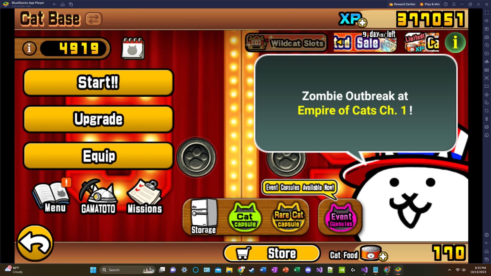
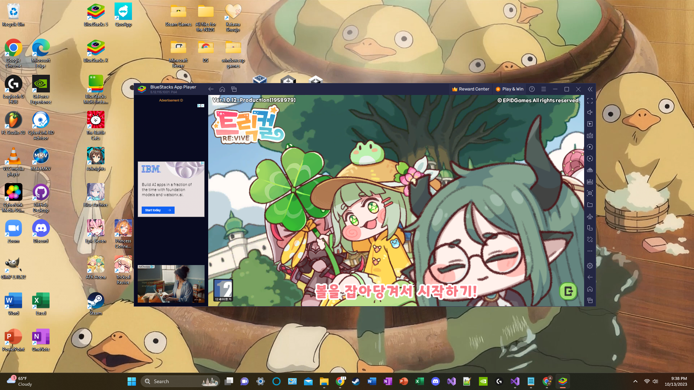
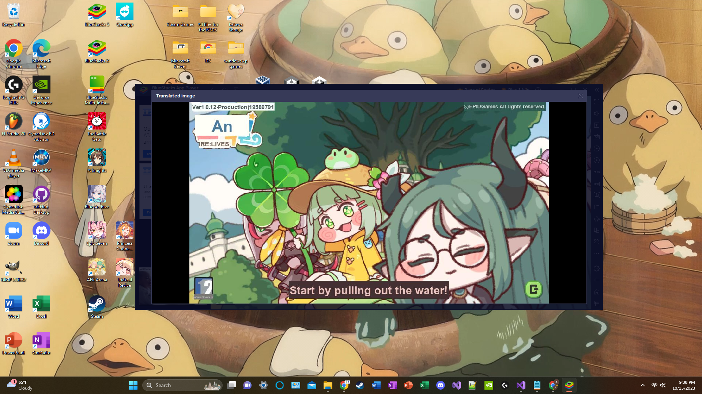

# BlueStacks: An Android Emulator
### Author: Andre de Rosas
### Edited 12/14/23

I mainly use BlueStacks to play gacha games available in English but also those unavailable in English (goals). BlueStacks is an app player that serves as a free Android Emulator. An emulator is something that allows a computing enviornment to behave like another one - in this case, this software serves as an Android phone on Windows or macOS (There are other emulators out there that are for other game systems. E.g., SNES, NES, etc.). With the previous statement in mind, there are shortcuts for the mobile applications in BlueStacks that can be saved to the main PC homescreen and many more features/buttons to make the BlueStacks environment **learnable** (easy to figure out the function) and easy to use.

### Sample Screen

Above I disabled ads to show the app player in a neater format: displaying the main menus and respective buttons.

First I will describe the general design of the app. The software has functions for the phone on the right sidebar and some functions at the top bar of the window. The right sidebar can be toggled to be viewable/nonviewable. The buttons, for the most part, are straight forward and if someone doesn't remember what a button is, he/she can hover over it to get the function name of a button and its shortcut. The functionality of the app makes it easy to **recall** how each button works as there is a hover feature and **natural mapping** (and to that extent **conventions** or how previous experience from applications cause expectations for a user) makes it easy to remember the location of buttons. For help, there is a designated question mark button that can be pressed that opens up a browser to a help section for BlueStacks. Syllatically, the menu bars are fairly simple and minimalistic - making them easier to understand - and very **visible** as they can be accessed/identified very easily. The help provided for the app player functions is superb and the number of functions provides a user with a lot of freedom to interact with the app player to his/her liking.

One notable button function is downloading apk files. Downloading an apk (Android Package Kit) means downloading an Android Program - this is useful for downloading projects such as BlueConnect and helpful for installing and using apps outside a given person's region without using a VPN. A VPN is a virtual private network and this just allows a person to have access to online services available in a different region.

Since I'm in the US, I can't play gacha games that are exclusive to a region like Korea. For example, I've downloaded an apk for a Korean game called Trickcal Revive from QooApp (interaction). There is a translation shortcut (Ctrl + Shift + L) but I have to do the shortcut everytime (after each screenshot I have to escape with Esc key) which can be cumbersome, and translations sometimes do not work with certain fonts. My **mental model** (Or how I thought the shortcut would function) for the translation shortcut was that it would have a filter over the screen to translate as the app changes screens but my **mental model** did not match with the **conceptual model** (How the shortcut actually functions). Translations only occur for one screen capture at a time (and this can be messy with auto-play text that changes the screen). The translation format isn't the best, but since I play gacha games with no heed to story - I focus on the gacha aspect - I only use the shorcut a few times, and I'm satisfied.

### Before Translation Shortcut

Here is the main loading screen that is in Korean.

### After Translation Shortcut

Here is the main loading screen translated into English.

Overall, the app covers my needs despite the translation feature not matching my **mental model** (outcome). Personally, BlueStacks is incredibly **effective** for playing gacha games as the experience is stable and playable on my PC (in comparison to my mobile devices being slower and crashing more frequently), **efficient** (discounting initial set-up) as playing a game can be done easily through a shortcut, and I'm **satisfied** (enjoyed my experience) with using BlueStacks. The overall design of BlueStacks makes the functionality of buttons very **learnable** and easy to use. If someone were to only focus on playing foreign gacha games to experience the story, I would advise waiting until the translation feature becomes a filter rather than a shortcut (as the current feature can make the experience the polar opposite of mine: not very effective, not efficient, and not satisfying).

